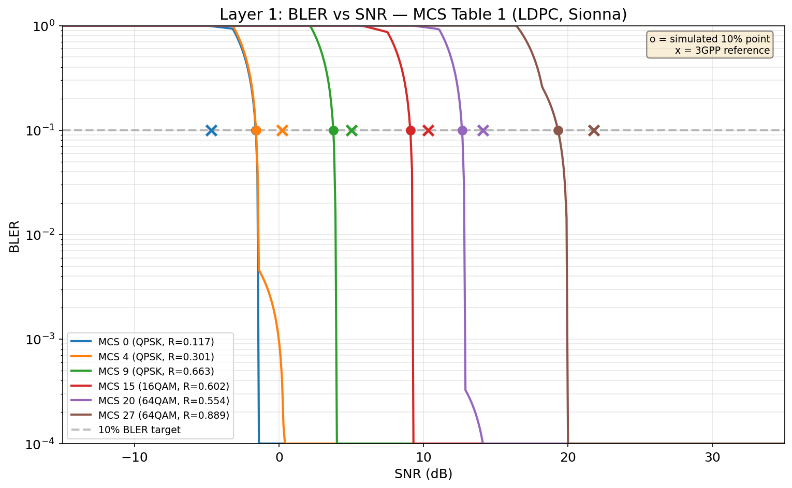

# Layer 1: PHY Abstraction BLER vs SNR Calibration

## Overview

Verify that EESM + Sionna BLER lookup tables produce BLER vs SNR curves
consistent with 3GPP LDPC AWGN reference data.

- **MCS Table**: 1 (TS 38.214 Table 5.1.3.1-1)
- **MCS indices**: 0, 4, 9, 15, 20, 27
- **Config**: 132 RE/PRB, 273 PRBs, rank 1
- **Pass criterion**: 10% BLER operating point deviation <= 1.0 dB

## BLER vs SNR Curves

## 10% BLER Operating Point Deviation

| MCS | Modulation | Code Rate | CBS | SNR@10% (dB) | 3GPP Ref (dB) | Delta (dB) | Status |
|-----|-----------|-----------|-----|-------------|---------------|------------|--------|
| 0 | QPSK | 0.117 | 2848 | -1.6 | -4.7 | N/A | SKIP (proxy MCS 3) |
| 4 | QPSK | 0.301 | 7200 | -1.6 | +0.2 | -1.80 | FAIL |
| 9 | QPSK | 0.663 | 8056 | +3.8 | +5.0 | -1.25 | FAIL |
| 15 | 16QAM | 0.602 | 7848 | +9.1 | +10.3 | -1.22 | FAIL |
| 20 | 64QAM | 0.554 | 7952 | +12.7 | +14.1 | -1.44 | FAIL |
| 27 | 64QAM | 0.889 | 8400 | +19.3 | +21.8 | -2.49 | FAIL |

## Result

**SOME DEVIATIONS EXCEED THRESHOLD**

## CBS Mismatch Note

Computed CBS (273 PRBs, rank 1) ranges from ~7000-8400 bits, but the Sionna
BLER tables only contain CBS values up to 2000 bits. The lookup uses the
nearest available CBS (2000). This CBS mismatch may contribute to deviations
for higher MCS indices where LDPC performance is more CBS-sensitive.

| MCS | Computed CBS | Used CBS |
|-----|-------------|----------|
| 0 | 2848 | 2000 |
| 4 | 7200 | 2000 |
| 9 | 8056 | 2000 |
| 15 | 7848 | 2000 |
| 20 | 7952 | 2000 |
| 27 | 8400 | 2000 |

## Notes

- BLER tables exported from Sionna LDPC simulation (AWGN channel)
- Reference points from R1-1711982 and MATLAB 5G Toolbox
- MCS 0 not in BLER tables (range starts at MCS 3); MCS 3 used as proxy
- Circle markers (o) = simulated 10% point; Cross markers (x) = 3GPP reference