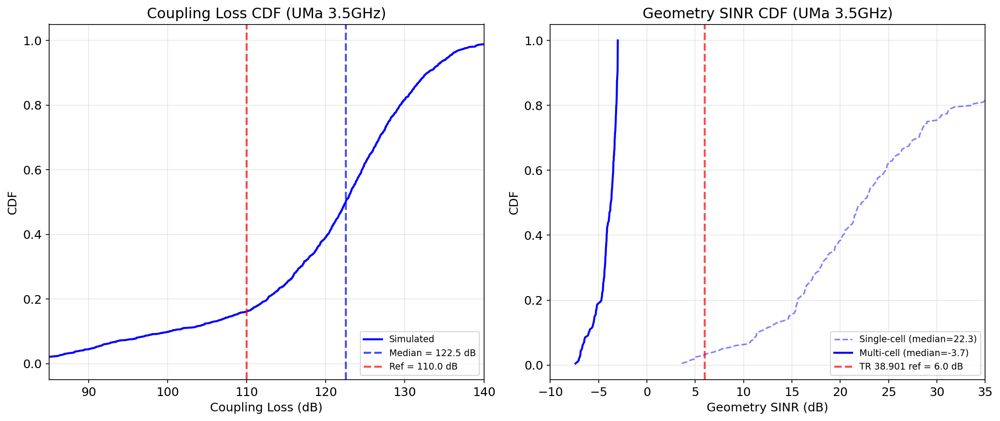
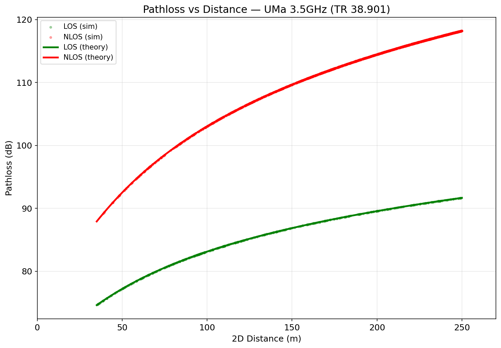

# Layer 2: Channel Model Calibration

## Overview

Verify the statistical channel model's pathloss distribution and geometry SINR CDF
against TR 38.901 section 7.8 calibration references for UMa 3.5 GHz.

## Configuration

| Parameter | Value |
|-----------|-------|
| Scenario | UMa |
| Carrier frequency | 3.5 GHz |
| BS height | 25.0 m |
| UE height | 1.5 m |
| Cell radius | 500.0 m |
| Min distance | 35.0 m |
| Shadow fading (LOS) | 4.0 dB |
| Shadow fading (NLOS) | 6.0 dB |
| Part A UEs | 2000 |
| Part B UEs | 200 (single-cell, no ICI) |
| Part C | 7-site 21-cell, 10 UE/cell, ISD=500m |

## Part A: Coupling Loss CDF (独立路损验证)

LOS ratio: 8.8%

| Metric | Simulated Median | Reference | Deviation | Status |
|--------|-----------------|-----------|-----------|--------|
| Coupling Loss (dB) | 122.5 | 110.0 | +12.5 | FAIL |

## Part B: Single-Cell SINR (参考, 无 ICI)

| Metric | Value |
|--------|-------|
| Single-cell SINR median | 22.3 dB |
| Note | 无小区间干扰, 不直接对标 TR 38.901 |

## Part C: Multi-Cell Geometry SINR (正式对标)

7-site 21-cell 部署, ISD=500m, 10 UE/cell, full ICI (load_factor=1.0)

| Metric | Simulated Median | Reference | Deviation | Status |
|--------|-----------------|-----------|-----------|--------|
| Multi-cell Coupling Loss (dB) | 112.8 | 110.0 | +2.8 | FAIL |
| Multi-cell Geometry SINR (dB) | -3.7 | 6.0 | -9.7 | FAIL |

## Conclusion

Pass criterion: CDF median deviation <= 2 dB

**SOME METRICS EXCEED THRESHOLD**
