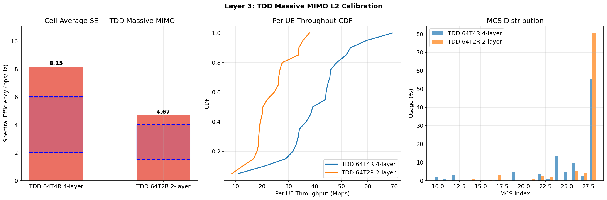

# Layer 3: L2 Functions — TDD Massive MIMO Calibration

## Overview

Verify the L2 stack (PF scheduler, link adaptation, HARQ) spectral efficiency
in TDD Massive MIMO configuration (64T, DDDSU pattern).

## Common Configuration

| Parameter | Value |
|-----------|-------|
| Duplex | TDD DDDSU |
| Bandwidth | 100 MHz |
| SCS | 30 kHz |
| PRBs | 273 |
| Carrier freq | 3.5 GHz |
| TX antennas | 64 |
| BS power | 46 dBm |
| Traffic | Full buffer |
| Channel | Statistical UMa |
| Slots | 2000 (warmup: 500) |
| Scheduler | PF (beta=0.98) |
| BLER target | 0.1 |

## PHY Backend

**LegacyPHY (EESM + OLLA + BLER lookup)** — 自研链路自适应路径。
SionnaPHY 存在 MCS 严重欠选问题 (MCS ~7 @ SINR 24 dB)，不用于校准。

## Known Deviations

1. **CSI feedback disabled**: 避免 Sionna tensor 兼容性问题。
2. **Single-cell, no ICI**: SE is higher than multi-cell deployment.
3. **SU-MIMO only**: No MU-MIMO pairing, max layers limited by min(TX ports, RX ant).

## Results

### Scenario 1: TDD 64T4R 4-layer

| Parameter | Value |
|-----------|-------|
| TX antennas | 64 |
| TX ports | 4 |
| Max layers | 4 |
| RX antennas | 4 |
| UEs | 20 |
| Duplex | TDD DDDSU |
| DL ratio | ~80% (3D + 0.7S out of 5 slots) |

| Metric | Value | Criterion | Status |
|--------|-------|-----------|--------|
| Spectral Efficiency | 8.152 bps/Hz | [2.0, 6.0] | OUT |
| Cell throughput | 815.2 Mbps | — | — |
| Cell edge (5%) | 20.4 Mbps | — | — |
| Avg BLER | 0.1614 | [0.05, 0.15] | OUT |
| Avg MCS | 25.4 | — | — |
| Avg Rank | 4.00 | — | — |
| Jain fairness | 0.9099 | — | — |
| PRB utilization | 80.0% | >70% | OK |
| **Overall** | | | **FAIL** |
### Scenario 2: TDD 64T2R 2-layer

| Parameter | Value |
|-----------|-------|
| TX antennas | 64 |
| TX ports | 4 |
| Max layers | 2 |
| RX antennas | 2 |
| UEs | 20 |
| Duplex | TDD DDDSU |
| DL ratio | ~80% (3D + 0.7S out of 5 slots) |

| Metric | Value | Criterion | Status |
|--------|-------|-----------|--------|
| Spectral Efficiency | 4.674 bps/Hz | [1.5, 4.0] | OUT |
| Cell throughput | 467.4 Mbps | — | — |
| Cell edge (5%) | 12.5 Mbps | — | — |
| Avg BLER | 0.1324 | [0.05, 0.15] | OK |
| Avg MCS | 27.0 | — | — |
| Avg Rank | 2.00 | — | — |
| Jain fairness | 0.9063 | — | — |
| PRB utilization | 80.0% | >70% | OK |
| **Overall** | | | **FAIL** |

## Figures

## Conclusion

**SOME METRICS OUT OF RANGE** — see individual scenario results.
