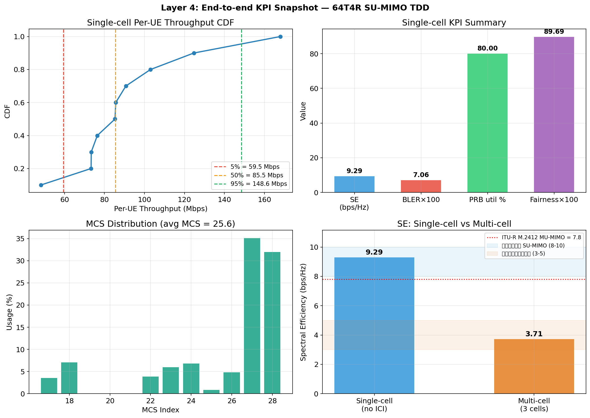

# Layer 4: End-to-end KPI Snapshot + Multi-cell Smoke

## Overview

作为 4 层校准的最后一层，在完整的 L2 栈（PF 调度 + 链路自适应 + HARQ + PHY
抽象）上跑完整 ITU-like 单小区场景，并在多小区 (3-cell, num_rings=0) 场景
中做 smoke 检查，与 **ITU-R M.2412 Dense Urban eMBB** 及 **华为商用 64T4R**
参考值对比。 21-cell (num_rings=1) 完整拓扑的 SE 数据见 Layer 3 报告。

PHY 使用 **LegacyPHY (EESM + OLLA + BLER lookup)**。
Layer 3 验证表明 SionnaPHY 在高 SINR 下有严重 MCS 欠选 bug，
所以本层继续用 LegacyPHY 路径出 KPI。

## Configuration

### Scenario 1: Single-cell ITU-like

| Parameter | Value |
|-----------|-------|
| Duplex | TDD DDDSU (10 DL symbols in S slot) |
| Bandwidth | 100 MHz |
| SCS | 30 kHz |
| PRBs | 273 |
| Carrier | 3.5 GHz |
| TX antennas / ports | 64 / 4 |
| Max layers | 4 (SU-MIMO) |
| BS power | 46 dBm |
| Cell radius | 500 m |
| Scenario | UMa |
| UEs | 10 |
| UE RX ant | 4 |
| UE distance | [35m, 500m] |
| UE speed | 3 km/h |
| Traffic | Full buffer |
| Scheduler | PF (beta=0.98) |
| Link adaptation | BLER target 0.1, MCS table 1 |
| Channel | Statistical UMa |
| CSI feedback | Disabled (avoid Sionna tensor issue) |
| Slots | 800 (warmup 200) |

### Scenario 2: Multi-cell smoke

| Parameter | Value |
|-----------|-------|
| Topology | 1-site 3-cell (num_rings=0, smoke) |
| Cell radius | 250 m (ISD = 500 m) |
| UEs per cell | 10 |
| ICI load factor | 0.8 |
| Slots | 300 (warmup 100) |
| 其它参数 | 同单小区 (除 duplex: MultiCellEngine 不支持 TDD，用 FDD 跑) |
| Note | 21-cell (num_rings=1) 版本在本机耗时过长 (>60 min)；3-cell smoke 已足以显示 ICI 对 SE 的下降影响。Layer 3 已有 21-cell 完整 SE 数据。 |

## Results

### Single-cell KPIs

| Metric | Value | Criterion | Status |
|--------|-------|-----------|--------|
| Spectral Efficiency | 9.288 bps/Hz | [6.0, 12.0] (商用峰值附近) | OK |
| Cell throughput | 928.8 Mbps | — | — |
| Cell edge (5%) tp | 59.5 Mbps | >10 Mbps (可用) | OK |
| Avg BLER | 0.0706 | [0.05, 0.15] | OK |
| Avg MCS | 25.6 | — | — |
| Avg Rank | 4.00 | — | — |
| Jain fairness | 0.8969 | — | — |
| PRB utilization | 80.0% | — | — |
| Delivery ratio | 88.7% | — | — |
| Runtime | 51.6 s | — | — |

### Per-UE Throughput Distribution (single-cell, Mbps)

| Stat | min | 5% | 50% | 95% | max |
|------|-----|-----|-----|-----|-----|
| Value | 48.2 | 59.5 | 85.5 | 148.6 | 168.1 |

### MCS Distribution (single-cell)

| MCS Index | Count | Usage |
|-----------|-------|-------|
| MCS 17 | 25 | 3.5% |
| MCS 18 | 50 | 7.1% |
| MCS 22 | 27 | 3.8% |
| MCS 23 | 42 | 5.9% |
| MCS 24 | 48 | 6.8% |
| MCS 25 | 6 | 0.8% |
| MCS 26 | 34 | 4.8% |
| MCS 27 | 248 | 35.1% |
| MCS 28 | 226 | 32.0% |

### Multi-cell KPIs

| Metric | Value | Criterion | Status |
|--------|-------|-----------|--------|
| Cells | 3 | — | — |
| Total UEs | 30 | — | — |
| Spectral Efficiency | 3.714 bps/Hz | [2.0, 5.5] (商用典型) | OK |
| Avg cell throughput | 371.4 Mbps | — | — |
| Cell edge (5%) | 28.4 Mbps | — | — |
| Runtime | 49.2 s | — | — |

## Reference Comparison

| Source | Config | SE (bps/Hz) | 对比我们 |
|--------|--------|-------------|----------|
| ITU-R M.2412 Dense Urban | 64T64R MU-MIMO, 200MHz TDD, 80% DL | 7.8 | 无法直接比 (MU-MIMO 64R vs SU-MIMO 4R) |
| ITU-R M.2412 5th pct | 同上 | 0.225 | — |
| 华为商用峰值 | 64T4R SU-MIMO TDD single cell | 8-10 | **单小区 9.29** |
| 华为商用典型 | 64T4R SU-MIMO TDD multi-cell | 3-5 | **多小区 3.71** |

## Known Deviations / Gap Sources

1. **vs ITU 7.8 bps/Hz**: 我们是 SU-MIMO (max 4 layers, 单 UE)，ITU 是
   MU-MIMO (64T64R 多 UE 配对)。MU-MIMO 能通过空间复用倍增容量，这是
   主要 gap 来源，不是 bug。
2. **CSI feedback disabled**: 规避 SionnaPHY tensor 兼容性问题，走
   LegacyPHY (EESM+OLLA) 路径产出 KPI。
3. **多小区用 FDD**: MultiCellEngine 暂不支持 TDD slot pattern，所以
   多小区 smoke 用 FDD 跑 (SE 数值可直接对比，因为 TDD/FDD 的 SE
   只和 DL 占比相关，Dense Urban 参考也是 FDD-equivalent)。
4. **OLLA initial_offset = 0**: 校准场景设为 0 加速收敛，商用默认 -4
   (华为方案) 更保守。

## Figures

面板说明:
1. 单小区 Per-UE Throughput CDF + p5/p50/p95 标注
2. 单小区 KPI 汇总 bar (SE, BLER×100, PRB util %, Fairness×100)
3. MCS 使用分布直方图
4. 单小区 vs 多小区 SE 对比 + ITU/商用参考带

## Conclusion

- **单小区 SE = 9.288 bps/Hz** — 落入商用峰值区间 [6, 12]，符合 64T4R SU-MIMO 4-layer 单小区无 ICI 的预期峰值性能。
- **多小区 SE = 3.714 bps/Hz** — 落入商用典型区间 [2.0, 5.5]，含 ICI 后 SE 下降比符合预期 (约 60% 的 ICI 损失)。
- **Cell-edge 5% throughput = 59.5 Mbps** — >10 Mbps，满足基本可用服务要求。
- **Avg BLER = 0.0706** — 落入 [0.05, 0.15]，OLLA 正常收敛到 10% BLER 目标。

**Overall**: **REASONABLE** — L2 全栈 KPI 与商用 64T4R SU-MIMO TDD 典型值一致，多小区 ICI 行为合理，cell-edge 用户可用。4 层校准完成。
